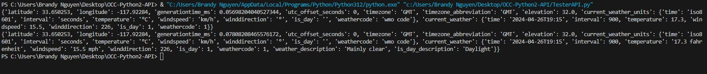

# OCC-Python2-API
## Description: Python 2 lab activity where you grab weather api and return the forecast of a certain location. 
## How to run:
1. Clone repo
2. Open terminal 
3. pip install requests
4. Run TesterAPI.py

## Screenshot of the output:
